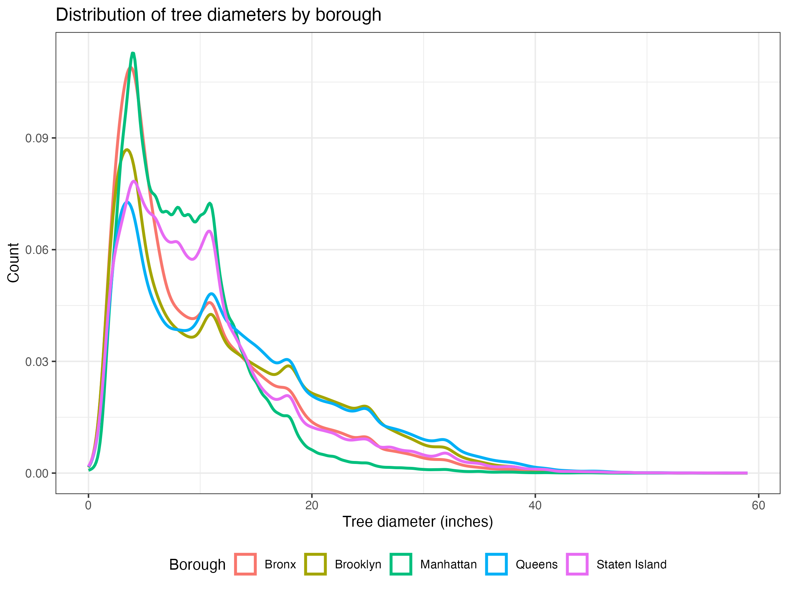
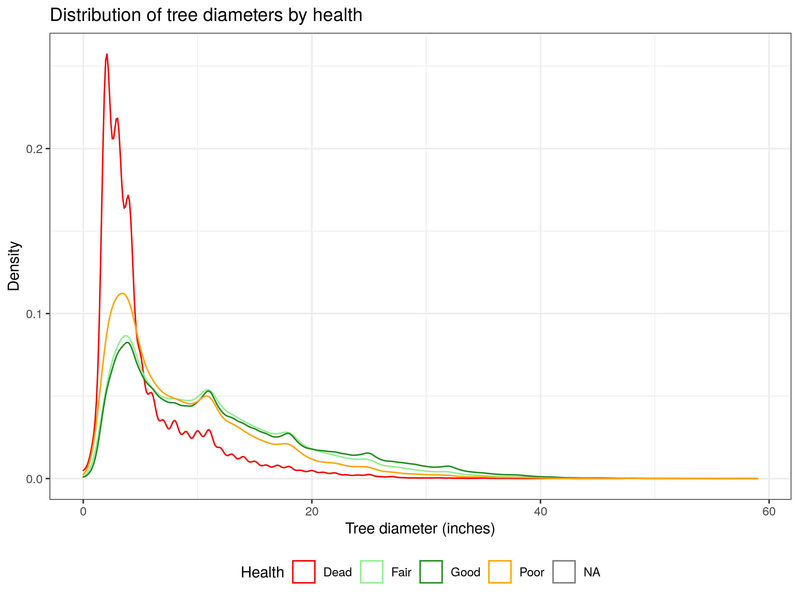
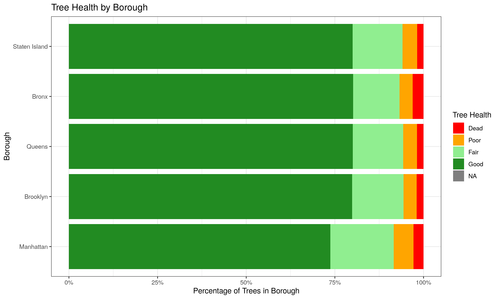
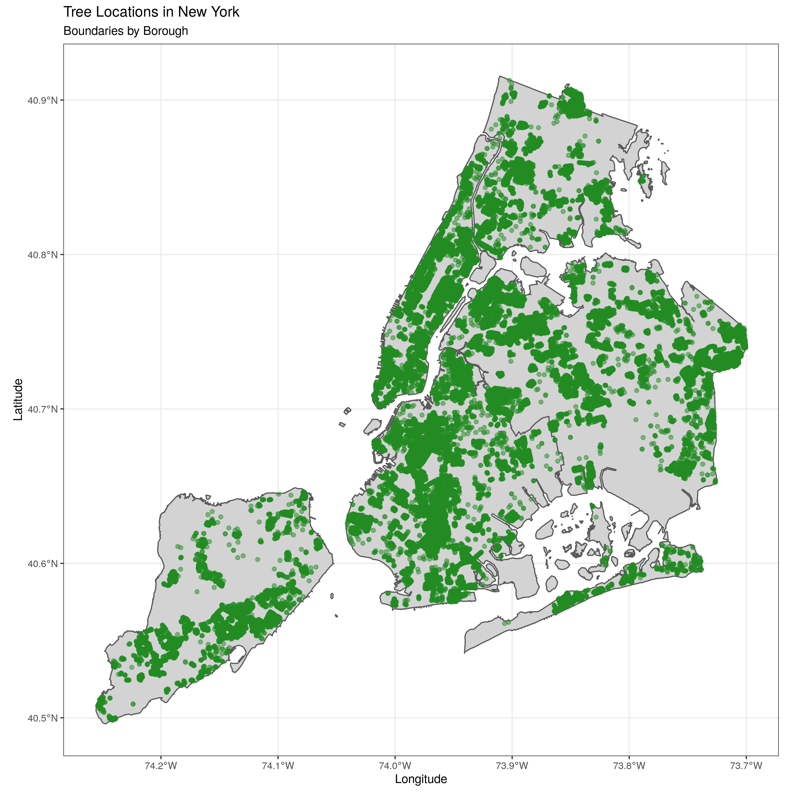
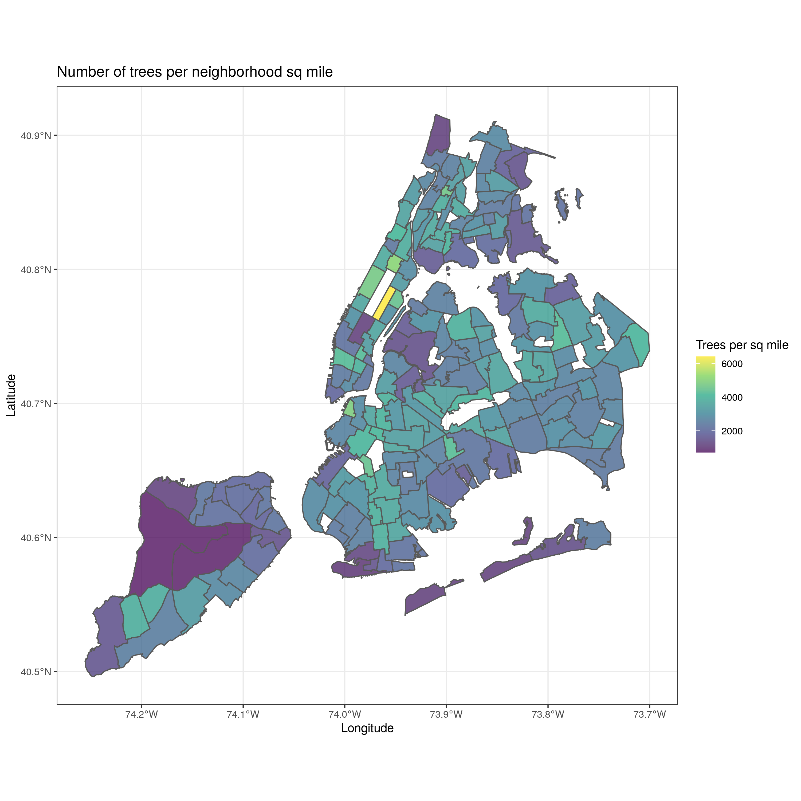

```{r setup, include=FALSE}
knitr::opts_chunk$set(echo = TRUE)
library(png)
```

# Tree Census Data Analysis Report

[Intro]

## Tree Diameter Distribution

[Text]

{width="49%"} {width="49%"}

## Tree Health by Borough

[Text]

{width="100%"}

## Top Tree Species by Borough

[Text]

{width="100%"}

## Tree Spatial Patterns

[Text]

{width="100%"}

[Text]

{width="100%"}
