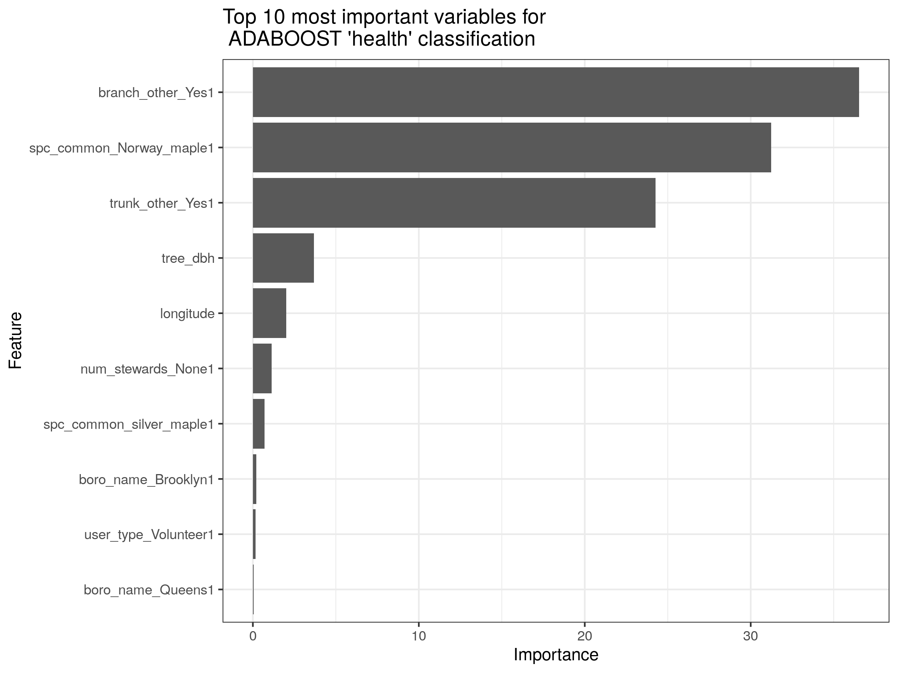

```{r setup, include=FALSE}
knitr::opts_chunk$set(echo = TRUE)
library(png)
library(tidyverse)
```

# Tree Census Data Analysis Report

This data is from the 2015 NYC Tree Census, available at [NYC OpenData](https://data.cityofnewyork.us/Environment/2015-Street-Tree-Census-Tree-Data/uvpi-gqnh/about_data). This dataset includes 44 variables that descibe the location, species, visible problems, and health of trees on New York City streets. The dataset was collected by a mixture of volunteers, NYC Parks staff, and individuals paid by the Tree Census program. My goal with this project was to explore this dataset, looking for patterns and relationships between tree health, species, and location. My initial questions/hypotheses about this dataset were:\
1. Are the trees with observations collected by volunteers more variable than the ones from staff members? Do the data cluster by who collected them?\
2. Are certain species of tree more common in certain locations than others? Are trees bigger in certain areas?\
3. Do the problems collected in the tree data predict tree health? Does tree size predict tree health?


## Overall variation in the data
  
I first wanted to look at overall trends of variation in this dataset. I performed a PCA analysis on a reduced form of the dataset. Namely, I had to remove all missing values, which eliminated the `health = "dead"` class, since the trees marked as dead were missing many variables. I also had to encode most of the variables in the dataset as numeric, since only the diameter at breast height is continuous. To do this, I first filtered out redundant columns (there were several describing geographic location at various resolutions). I kept the borough name, latitude, and longitude. I also restricted the species to the common species name, and just the top 20 most popular species (out of 132), with the rest in an "other" category. I used the *fastDummies* package to do this. I centered and scaled the data before performing PCA.
  
There seems to be three loose clusters in the PCA plot below. I explored many different labels to color the data, but in the rotation matrix for the PCA, the most important variable in the second component was the dummy variable for being in Staten Island. Therefore, I color coded the PCA by borough, and there does seem to be some loose clustering based on borough, most pronounced being for Staten Island.
  
{width="100%"}
  
Looking at a map of boroughs in NYC, this makes sense to me, as Staten Island is the most removed from the other boroughs, whereas the other four have more overlap.
  
  
## Tree Diameter Distribution

The only true numerical variable in this dataset is the tree diameter at breast height. This variable was collected as circumference in inches by data collectors, and the analysts on the NYC project converted it to diameter. When initially cleaning this data, it appeared that there were some unreasonable outliers (trees with diameters \> 60 inches, with some as large as 400 inches). It was not clear to me what was causing these errors - there did not seem to be an extra 0 at the end or any pattern that might indicate measurement in a different unit. I decided to remove these outliers from the dataset for subsequent analysis.

Below, I have plotted the distribution of tree diameters by the borough in which they are located (left) and by the health of the tree (right). The histograms show that the peak tree diameter is less than 10 inches, with the majority of trees having diameters between 0 and 20 inches. The distribution of tree diameters is similar across boroughs, but Manhattan seems to have smaller trees on average than the other boroughs, and Brooklyn and Queens seem to have the largest trees. There are more notable differences in the distribution of tree diameters by health. It seems that average tree diameter seems to increase as health status increases, from dead, to poor, to fair, to good. Additionally, while the distribution of tree diameters takes a similar shape for trees in poor, fair, and good health, the distribution of tree diameters for dead trees is quite different. Dead trees have a much higher proportion of trees with diameters less than 10 inches, and it seems to have a more jagged distribution.

One other interesting pattern is evidence for banding, but not in places you would normally expect. The modes or "humps" in the distributions are at 3-4 inches, 11 inches, 18 inches, 35 inches, and 32 inches. Typically, with measurements, we would expect people to round to values like 5, 10, 15, 20, etc. However, it seems like this common banding pattern did occur - just at the level of the circumference calculation. Both the circumference and diameter were rounded to the nearest whole inch in this dataset, so these "humps" we see in tree diameter would likely correspond to circumference measurements of 10, 30, 50, 75, and 100 inches, respectively. This is a good reminder that data collection and cleaning can introduce patterns that are not necessarily reflective of the underlying data.

{width="49%"} {width="49%"}

## Tree Health by Borough

The broadest informative geographical classification in this datatset is Borough. I wanted to see if there were any differences in tree health by borough. The bar chart below shows the distribution of tree health by borough. The majority of trees in all boroughs are in good health. Staten Island has the highest proportion of trees in good health, and Manhattan has the highest proportion of trees in sub-good health. The proportion of dead trees is similar across all boroughs, but is highest in Manhattan and the Bronx.

{width="100%"}

## Top Tree Species by Borough

Across New York City streets, there are 132 different species. I wanted to compare the most common species in each borough. The bar chart below shows the top 5 species in each borough. The most common species in both Manhattan and the Bronk is the honeylocust, while the most common species in Brooklyn and Queens is the London planetree. Staten Island seems to be the black sheep of the boroughs, with the most common species being the Callery pear. It is also the only borough where the honeylocust is not in the top 3 (or top 5) species, and the only borough including the cherry and the red maple in its top 5 most common species.

{width="100%"}

## Tree Spatial Patterns

I next wanted to explore the spatial pattern of the trees. The plot below is of the location of each tree in the dataset, depicted as a green dot. The gray boundaries reflect the five boroughs of New York City. Through this initial plot, we can see some initial patterns that reflect an uneven distribution of trees across the city. However, with this course depiction it's difficult to identify patterns of density.

{width="100%"}

In the plot below, I have plotted the density of trees per square mile, outlined by neighborhood. This gives a sharper resolution of patterns of tree density across the city. The lowest density of trees is 710 per square mile in the "New Springville-Bloomfield-Travis" neighborhood of Staten Island, while the highest density of trees is 6,412 per square mile in the "Upper East Side-Carnegie Hill" neighborhood of Manhattan. This plot shows that tree density is not evenly distributed across the city, and that there are some neighborhoods with much higher tree density than others. This plot also shows that neighbors tend to be more similar to each other than to the boroughs at large. We can see this looking at boundary neighborhoods, that tend to more closely reflect each other than the averages across the entire boroughs.

{width="100%"}
  
  
## Predict Tree Health

I next wondered whether any of the variables in the dataset were able to accurately predict tree health - especially since this dataset includes information about various root, branch, trunk, guard, and sidewalk damage. First, naively, I wanted to see whether any of these problems variables seem to associate with tree health.

```{r include=FALSE}
tree_data <- suppressWarnings(read_csv("./data/derived_data/tree_data_cleaned.csv"))

knitr::kables(
  list(
    # the first kable() of health by user type
    knitr::kable(
      prop.table(table(tree_data$health, tree_data$user_type)), 
      digits = 2, valign = 't'
    ),
    # the second kable() of health by trunk other
    knitr::kable(prop.table(table(tree_data$health, tree_data$trunk_other)), 
                 digits = 2, valign = 't')
  ),
  caption = 'Tree health by user collecting data (left) and "other" trunk problems (right).'
)
```

For these two example tables, we can see that there does appear to be a non-random association between both the user type and tree health and "other" trunk problems and tree health. I next wanted to see if I could classify the trees into health categories based on the explanatory variables in the dataset. Since so many of the variables in the dataset are categorical, I had to decide which to keep and how to re-code. Out of the 44 initial variables in the tree dataset, I decided to keep as explanatory variables: tree diameter at breast height, latitute, longitude, location with respect to curb, status (alive or dead), borough name, common species name, number of stewards, user type collecting data, presence and helpfulness of guards, presence of sidewalk damage, and problems (with roots - grate, stone, other; with trunk - wires, lights, other; with branch - with light, shoes, or other). There were many variables that reflected geography at various resolutions, and I decided that the name of the borough and latitute and longitude would likely be sufficient. Since there are 132 different species in this dataset, I decided to reduce the dimensionality of this variable by grouping the species into the 20 most common species and then grouping the remaining species into an "other" category.

I then used the *fastDummies* package to do one-hot encoding to create a "dummy" version of the dataset, where all the categorical variables were re-encoded as factors and as binary 0/1. I then split the data into a training and testing set with a 70/30 train-test split. I decided to use the "AdaBoost.M1" model within the *caret* package for its ability to handle multi-categorical response variables and a mixture of categorical and continuous predictors. In order to run the *caret* functions, I had to remove any `NA` values. This eliminated the `health = "Dead"` class, as all trees marked as dead had missing information for many variables - including species. Therefore, the 5-fold cross validation results were only able to classify trees into "Fair", "Good", and "Poor" health classes. Model results following training are below:
  
```{r, echo=FALSE, results='asis'}
res <- knitr::knit_child('./figures/ADABOOST_model.txt', quiet = TRUE)
cat(res, sep = '\n')
```
  
{width="49%"} {width="49%"}
  
After training on the training dataset, I applied the model to the test set. The results from the confusion matrix are below:
  
```{r, echo=FALSE, results='asis'}
confusion <- knitr::knit_child('./figures/ADABOOST_model_confusion.txt', quiet = TRUE)
cat(confusion, sep = '\n')
```
  
As you can see, the model performs pretty well at predicting tree health (~80%). However, that seems to be predominantly driven by the "good" category, which is the majority of the cases. The model performs much worse at predicting trees in poor or fair health. In fact, the model predicts no trees to be in poor health, and it missclassifies almost all of the trees in "fair" health to be in "good" health. However, it does seem promising that the missclassified results seem to make sense - the trees in "poor" health when missclassified tend to be predicted to be in "fair" health rather than "good" health. In an earlier version of the model that I ran, when I only used 40% of the data for training and 60% for testing, with only 2-folds, the model did much better at predicting the fair and poor classes. The sensitivity for both "fair" and "poor" was around 45% (which is still not high, but much better than this iteration). When training the first time, the optimized parameters were `mfinal=3,maxdepth=3`, which might make the difference here. If I were going forward with this project, I would want to continue to tune this model, choose a different model, or do some up or down sampling in the training data to fix this issue. 
  
In this iteration, I wanted to see which variables seemed to be most important in predicting tree health. In the plot below, we can see that "branch_other", "Norway maple" and "trunk_other" are by far the most important variables for classifying tree health. 
  
{width="100%"}
  
  
## Conclusions

Through data visualizations and classification techniques, I was able to explore this NYC 2015 street tree census dataset. It was interesting to see how the data varied geographically, and how different variables were able to help predict the health of the trees. I went into this project hypothesizing that we would be able to see trends varying by geography (species, health, etc) and by user type. I found this hypothesis to be mostly correct, though classifiers had a harder time classifying trees into the low sample size "Fair" and "Poor" health classes.

It was very interesting to work with this dataset. This was the first dataset I've worked with that is made up of a majority of categorical variables, which made analyses difficult. I think it would be interesting to explore how different encoding and missing-value handling strategies would have changed classification or other prediction analysis results, since with the method I used I filtered out all rows with missing data, eliminating the `health="Dead"` class entirely. I think it would also have been interesting to run the data as-is through an AI model to see how that changed things. One question that I had that I wasn't sure the best way to answer was to see if the data collected was more variable between the different users (parks staff, tree census staff, and volunteers). On the NYC tree census website, they link a report about volunteer data collection accuracy, but in the published dataset we are not able to see individual users. I think it would have been really cool to see how individual measurements changed over time, or even to see if we could predict/cluster measurements into groups based on the specific individual.

Overall, I really enjoyed this class, and I had a lot of fun exploring different visualization and analysis tools that I don't normally use in my research - such as prediction and classification. Thank you!
