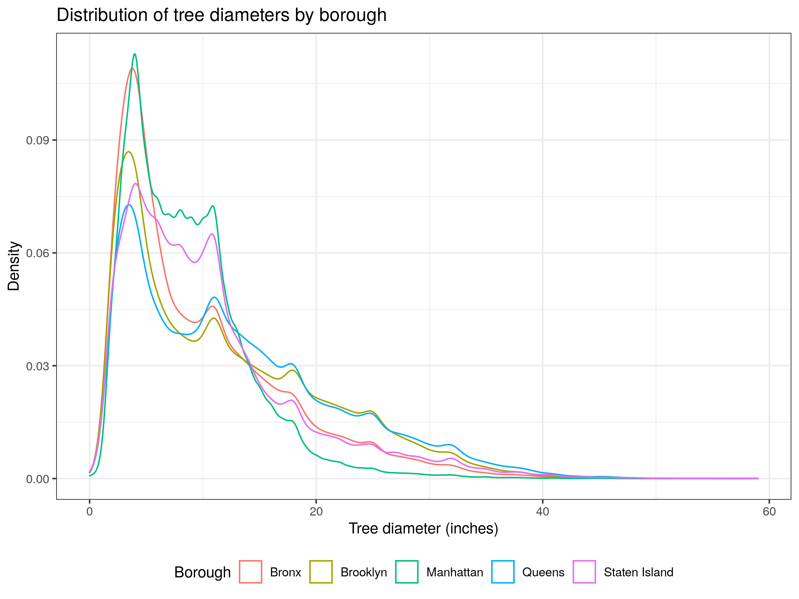
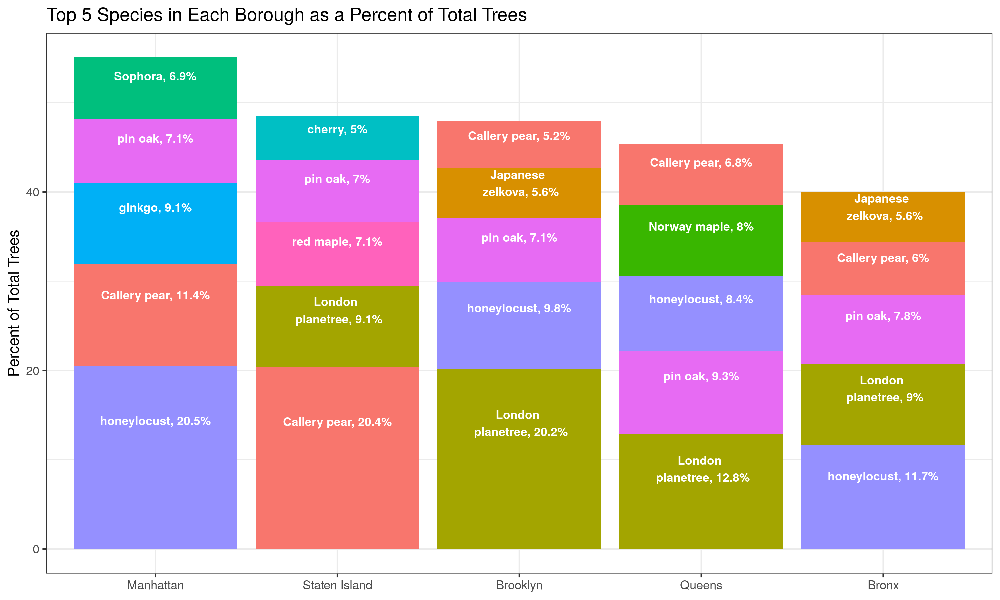

```{r setup, include=FALSE}
knitr::opts_chunk$set(echo = TRUE)
library(png)
```

# Tree Census Data Analysis Report

This data is from the 2015 NYC Tree Census, available at NYC OpenData. This dataset includes information about the location, species, visible problems, and health of trees on New York City streets. The dataset was collected by a mixture of volunteers, NYC Parks staff, and individuals paid by the Tree Census program. My goal with this project was to explore this dataset, looking for patterns and relationships between tree health, species, and location.  
  
  
## Tree Diameter Distribution
  
The only true numerical variable in this dataset is the tree diameter at breast height. This variable was collected as circumference in inches by data collectors, and the analysts on the NYC project converted it to diameter. When initially cleaning this data, it appeared that there were some unreasonable outliers (trees with diameters > 60 inches, with some as large as 400 inches). It was not clear to me what was causing these errors - there did not seem to be an extra 0 at the end or any pattern that might indicate measurement in a different unit. I decided to remove these outliers from the dataset for subsequent analysis. 
  
Below, I have plotted the distribution of tree diameters by the borough in which they are located (left) and by the health of the tree (right). The histograms show that the peak tree diameter is less than 10 inches, with the majority of trees having diameters between 0 and 20 inches. The distribution of tree diameters is similar across boroughs, but Manhattan seems to have smaller trees on average than the other boroughs, and Brooklyn and Queens seem to have the largest trees. There are more notable differences in the distribution of tree diameters by health. It seems that average tree diameter seems to increase as health status increases, from dead, to poor, to fair, to good. Additionally, while the distribution of tree diameters takes a similar shape for trees in poor, fair, and good health, the distribution of tree diameters for dead trees is quite different. Dead trees have a much higher proportion of trees with diameters less than 10 inches, and it seems to have a more jagged distribution. 
  
One other interesting pattern is evidence for banding, but not in places you would normally expect. The modes or "humps" in the distributions are at 3-4 inches, 11 inches, 18 inches, 35 inches, and 32 inches. Typically, with measurements, we would expect people to round to values like 5, 10, 15, 20, etc. However, it seems like this common banding pattern did occur - just at the level of the circumference calculation. Both the circumference and diameter were rounded to the nearest whole inch in this dataset, so these "humps" we see in tree diameter would likely correspond to circumference measurements of 10, 30, 50, 75, and 100 inches, respectively. This is a good reminder that data collection and cleaning can introduce patterns that are not necessarily reflective of the underlying data. 
  

{width="49%"} {width="49%"}
  
  
## Tree Health by Borough

The broadest informative geographical classification in this datatset is Borough. I wanted to see if there were any differences in tree health by borough. The bar chart below shows the distribution of tree health by borough. The majority of trees in all boroughs are in good health. Staten Island has the highest proportion of trees in good health, and Manhattan has the highest proportion of trees in sub-good health. The proportion of dead trees is similar across all boroughs, but is highest in Manhattan and the Bronx.

{width="100%"}
  
  
## Top Tree Species by Borough
  
Across New York City streets, there are 132 different species. I wanted to compare the most common species in each borough. The bar chart below shows the top 5 species in each borough. The most common species in both Manhattan and the Bronk is the honeylocust, while the most common species in Brooklyn and Queens is the London planetree. Staten Island seems to be the black sheep of the boroughs, with the most common species being the Callery pear. It is also the only borough where the honeylocust is not in the top 3 (or top 5) species, and the only borough including the cherry and the red maple in its top 5 most common species. 
    
{width="100%"}
  
  
## Tree Spatial Patterns
  
I next wanted to explore the spatial pattern of the trees. The plot below is of the location of each tree in the dataset, depicted as a green dot. The gray boundaries reflect the five boroughs of New York City. Through this initial plot, we can see some initial patterns that reflect an uneven distribution of trees across the city. However, with this course depiction it's difficult to identify patterns of density.
  
{width="100%"}
  
In the plot below, I have plotted the density of trees per square mile, outlined by neighborhood. This gives a sharper resolution of patterns of tree density across the city. The lowest density of trees is 710 per square mile in the "New Springville-Bloomfield-Travis" neighborhood of Staten Island, while the highest density of trees is 6,412 per square mile in the "Upper East Side-Carnegie Hill" neighborhood of Manhattan. This plot shows that tree density is not evenly distributed across the city, and that there are some neighborhoods with much higher tree density than others. This plot also shows that neighbors tend to be more similar to each other than to the boroughs at large. We can see this looking at boundary neighborhoods, that tend to more closely reflect each other than the averages across the entire boroughs. 

{width="100%"}
